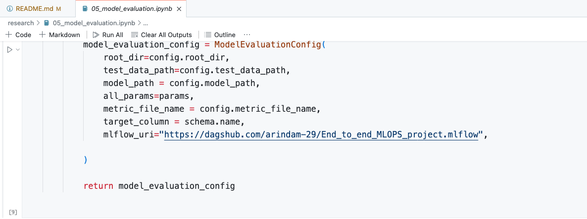

# End to end ML Project with CICD deploy to AWS
End to end MLOPS CICD Project
export MLFLOW_TRACKING_URI=https://dagshub.com/arindam-29/End_to_end_MLOPS_project.mlflow
export MLFLOW_TRACKING_USERNAME=arindam-29
export MLFLOW_TRACKING_PASSWORD=8bc9e1fe42d88ec70f8944331be9516507e338e0

## Prerequisites for this project:
    1. Github account [Project folders, github actions for CICD pipeline]
    2. AWS account [ECR and EC2 instance]
    3. Dagshub account [Experiments Tracking]
    4. VS Code and Terminal

## Reference Repository:
    https://github.com/arindam-29/CICD_Wine_Quality_Prediction

## Project Setup:
    1. Create a new Repository "CICD_Wine_Quality_Prediction"
    2. Add README.md and Python .gitignore
    3. Clone the new Repository into local folder
    4. Open the local repository folder in VS Code

### Building the Project [inside local repository folder in VS Code]:
1. Create a Python virtual environment
    ```
    python3 -m venv venv
    source venv/bin/activate
    ```
2. Project Structure and Setup:
    
    * We’ll create a template.py file to where we’ll write all the necessary files and modules for our project. You can find the file content [here](https://github.com/arindam-29/CICD_Wine_Quality_Prediction/blob/main/template.py)
    * Copy this template.py into the project and run, this will create necessary files and folders required for the project
    ```
    python template.py
    ```
    * Copy the content of setup.py from [here](https://github.com/arindam-29/CICD_Wine_Quality_Prediction/blob/main/setup.py) and modify the info as needed. We utilise setup.py to ensure that all modules are installed as a package. This ensures that there are no issues when importing from any location. In this case, we are creating 'src' as a package
    ```
    AUTHOR_NAME = "Arindam C"
    REPO_NAME = "CICD_Wine_Quality_Prediction"
    AUTHOR_USER_NAME = "arindam-29"
    SRC_REPO = "mlProject"
    AUTHOR_EMAIL = "arindam.choudhury.email@gmail.com
    ```
    * Add necessary libraries into requirement.txt [here](https://github.com/arindam-29/CICD_Wine_Quality_Prediction/blob/main/requirements.txt)
    * Open terminal and execute 
    ```
    pip install -r requirement.txt
    ```
3. Setting up logging Module:
    * Add a file src/mlProject/__init__.py
    * Copy the file content from [here](https://github.com/arindam-29/CICD_Wine_Quality_Prediction/blob/main/src/mlProject/__init__.py)

4. Setting up Utils Module:
    * In the "utils" part of our code, we put things that we use a lot in different places. For example, if we keep reading information from a YAML file and using it everywhere, instead of doing the same thing in many places, we can just write one function read_yaml it once in a file called "utils/common.py." This way, we can easily reuse that piece of code wherever we need it in our project. It helps keep things organised and saves us from writing the same code over and over again.
    * Basic functions:
        * create_directories: Creates directories specified in the input list. It also logs the creation of each directory.
        * save_json: Saves data as a JSON file at the specified path.
        * load_json: Loads data from a JSON file and returns it as a ConfigBox object.
        * save_bin: Saves binary data to a file using the joblib library.
        * load_bin: Loads binary data from a file using the joblib library.
        * get_size: Retrieves and returns the size of a file in kilobytes.

5. Project Workflow:
    * config/config.yaml:- The config.yaml file organises key paths for various stages in a data science pipeline. It specifies locations for data ingestion, validation, transformation, model training, and evaluation, making it easy to manage and track artefacts. Adjust paths as needed for your project. Modify as needed
    ```
    artifacts_root: artifacts

    data_ingestion:
    root_dir: artifacts/data_ingestion
    source_URL: https://github.com/someshnaman/End_to_end_MLOPS_project_/raw/master/wine-data.zip
    local_data_file: artifacts/data_ingestion/data.zip
    unzip_dir: artifacts/data_ingestion

    data_validation:
    root_dir: artifacts/data_validation
    unzip_data_dir: artifacts/data_ingestion/winequality-red.csv
    STATUS_FILE: artifacts/data_validation/status.txt

    data_transformation:
    root_dir: artifacts/data_transformation
    data_path: artifacts/data_ingestion/winequality-red.csv

    model_trainer:
    root_dir: artifacts/model_trainer
    train_data_path: artifacts/data_transformation/train.csv
    test_data_path: artifacts/data_transformation/test.csv
    model_name: model.joblib

    model_evaluation:
    root_dir: artifacts/model_evaluation
    test_data_path: artifacts/data_transformation/test.csv
    model_path: artifacts/model_trainer/model.joblib
    metric_file_name: artifacts/model_evaluation/metrics.json
    ```
    * research/01_data_ingetion.ipynb:- Copy from [here](https://github.com/arindam-29/CICD_Wine_Quality_Prediction/blob/main/research/01_data_ingetion.ipynb). To run your notebook with the python environment in VSCode, select the kernel from the upper right menu and choose "venv". Alternatively, from your terminal, run `jupyter notebook research/data_ingestion.ipynb` and then open the link from the logs or http://localhost:8888/notebooks/data_ingestion.ipynb from your browser
    * src/mlProject/entity/config_entity.py:- Now we’ll convert this into modular coding. We’ll follow the same workflow in order to updating the files. Update the src/mlProject/entity/config_entity.py Module(Copy paste from ipynb file)
    * src/config/configuration.py:- with all the configmanager
    * Now we’ll update the component folder. Create new file data_ingestion.py and copy paste all the ingestion related code
    * Now we’ll create a file in the pipeline folder stage_01_data_ingestion.py and insert the main calling function
    * For checking, let’s Try to execute Code from main.py file.Import all the component to main.py
    * Open the terminal and execute python main.py. You’ll be able to see data ingestion pipeline will get completed. Note:- if python main.py giving some issue try running with python3 main.py

### MLFLOW Integration:

* To facilitate experiment monitoring, we will utilise MLflow. This choice is motivated by the potential involvement of multiple developers in the project. In the event of collaboration on experiments, we will employ DagsHub, an open-source Data Science collaboration tool.
* https://dagshub.com/ - This is the URL for the DAGS hub
    ```
    Step-1 Register with your Github account.
    Step-2 Skip the Personalisation
    Step-3 You’ll be on Home page
    Step-4 We’ll need to conned our project github Repo with DagsHUB. Click of Create New Repository
    Step-5 Click of Connect a repository, Click on GitHUB
    Step-6 Authenticate with DugsHUB
    Step-7 Select the Repository[ Make Sure Your all the updated code should be available in your remote repository.
    Step-8 Click on connect Repository and Your github Repository will get connected to DagsHUB
    Step-9 Click on remote and click on experiments and copy & paste it to notepad the below Information. With the help of these parameters we’ll be able to capture the experiments remotely
    ```
* Now come to your VS_code and as like other Modules, create a new module research/05_model_evaluation.ipynb. For the research purpose we’ll Set these MLFlow environment variable with the help of OS Module


* Import necessary metrics for the evaluation and create the Model evaluation class

* Create the file script and execute the code
* We’ll be able to see artefacts will get created in data_validation

* Now to to Dagshub and open MLflow UI

* Suppose to change the parameter and check how the model is performing. Go to params.config and change the values

* Again run the ipynb file. You will be able to see the second run of the Experiment
* Click on any experiment to view details

* Our Model Evaluation and Mlflow integration is running fine. Now can previous workflow we can again Modularise our code.

Note:-
After we transform the model_evalution module in Modlarise. We need to set the environment variable for DagsHUB through terminal.

* After that to check weather everything is running fine execute python main.py

### Pipeline Creation:
* Create prediction.py in the pipeline and copy the code from [here](https://github.com/arindam-29/CICD_Wine_Quality_Prediction/blob/main/src/mlProject/pipeline/prediction.py)
* After finishing the Prediction Pipeline project, the next step involves completing the app.py file. In this phase, we will import the pipeline and establish the API Routes using Flask. Copy the code from [here](https://github.com/arindam-29/CICD_Wine_Quality_Prediction/blob/main/app.py)
* Creation of the route, proceed to develop the template (HTML pages for rendering) and static (for CSS beautification)   
* After that open the Terminal and execute python app.py
* Follow the link http://127.0.0.1:8080/
(On your default Browser your project will get open)

* Fill the values to get the prediction

### Deployment to AWS with CI/CD with Github Actions:
* Navigate to .gitkeep/workflows and generate a new main.yaml file. In this file, outline the steps for deploying to EC2 with ECR, specifying each detail in the process.GitHub Actions will be employed for seamless CI/CD integration. 
* To access all the steps, navigate to your GitHub repository and click on the "Actions" tab
* We can observe that GitHub offers various services tailored to different objectives. We’ll be using EC2, ECR and Docker.click on configure to get the steps
* Copy All the Steps and paste it to the main.yaml

* This YAML file defines a GitHub Actions workflow with three main jobs: Continuous Integration (CI), Continuous Delivery (CD), and Continuous Deployment. Here's a summary:
```
Continuous Integration (CI) Job:
●	Triggered on pushes to the master branch, excluding changes to README.md.
●	Runs on an Ubuntu latest environment.
●	Steps include checking out the code, linting the repository, and running unit tests.

Continuous Delivery (CD) Job:
●	Depends on the successful completion of the CI job.
●	Runs on an Ubuntu latest environment.
●	Steps include checking out the code, installing utilities (jq, unzip), configuring AWS credentials, logging in to Amazon ECR, and building, tagging, and pushing a Docker image to ECR. The image is tagged as "latest."

Continuous Deployment Job:
●	Depends on the successful completion of the CD job.
●	Runs on a self-hosted environment.
●	Steps include checking out the code, configuring AWS credentials, logging in to Amazon ECR, pulling the latest Docker image from ECR, running the Docker image to serve users, and cleaning up previous Docker images and containers.
```
* Setting up AWS:
```
Create IAM new user: Click on attach Policies AmazonEC2ContainerRegistryFullAccess & AmazonEC2FullAccess. Create Access key and save Access key and Secret access key
Create ECR Repository: Create a Private repository, use name as "wine". Save the ECR Repository name
Create EC2 Instance: create a new Ubuntu instance with t2.large (8GB RAM will be sufficient for this project)
```
* Setting Remote Access to EC2 Instance: Run the following commands to setup docker
```bash
sudo apt-get update -y
```
```bash
sudo apt-get upgrade
```
```bash
curl -fsSL https://get.docker.com -o get-docker.sh
```
```bash
sudo sh get-docker.sh
```
```bash
sudo usermod -aG docker ubuntu
```
```bash
newgrp docker
```
```bash
docker --version
```
* Link EC2 with Github & Setting CI/CD with Github Actions:

Now that We’ve Successfully installed Docker. Now we’ll do our EC2 Setup with our Github for that Go to Github Repo and navigate to
setting>actions>runner>new self hosted runner> choose os> then run command one by one


* Execute the last command ./run.sh. It will connect EC2 with Github. Our Ci/CD is Set here
* Setting AWS Secrets in Github

Now We’ll need to Setup AWS Secrets with github.for that go Secrets & Variables & click on Actions> new repository Secrets

Create five secrets (copied from Setting up AWS section)


* Make a small change to the code and push it to the repository


* Go access Again go to your AWS/ EC2 Instance, click on instance ID, click on Security port, Edit inbound rules, expose port 8080. Click on add rule. Keep it Custup TCP add port 8080 and select ip 0.0.0.0/0 and click on save rules. 

Take the Public IPv4 address, paste it in the browser with the post 8080.


* Fill the values to get the prediction
